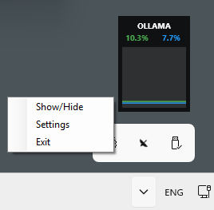

# 🦙 Ollama Usage Tracker

A lightweight, premium WPF overlay for monitoring your **Ollama Cloud** usage quotas in real-time. Designed to stay out of your way while keeping you informed.



## ✨ Features

- **Minimalist Overlay**: A tiny (90x120px) borderless window that stays on top of all other windows.
- **Real-Time Tracking**: Automatically fetches Session and Weekly usage percentages every 10 seconds (configurable).
- **Visual Analytics**: Dynamic line charts showing usage trends.
- **Smart Auth**: Integrated `WebView2` login flow—captures session cookies securely without ever storing your password.
- **Tray Integration**: Runs in the system tray with a quick-access menu for settings and visibility toggles.
- **Debug Mode**: Detailed logging for troubleshooting.

## 🚀 Quick Start

1. **Clone the Repo**:
   ```bash
   git clone https://github.com/kabcnd/OllamaUsageTracker.git
   cd OllamaUsageTracker
   ```
2. **Build and Run**:
   Open the solution in Visual Studio or run via CLI:
   ```bash
   dotnet run
   ```
3. **Login**:
   - Right-click the Ollama icon in the system tray.
   - Select **Settings**.
   - Click **Login to Ollama**.
   - Sign in through the secure browser window. Once you reach the settings page, the app will automatically capture your session.

## ⚙️ Configuration

Settings are stored in `settings.json` (created on first run):

| Setting | Description |
| :--- | :--- |
| `CookieValue` | Your active session cookie (captured automatically). |
| `DebugEnabled` | Set to `true` to enable logging to `debug.log`. |
| `UpdateIntervalSeconds` | Frequency of data updates (default: 10s). |

## 🛠️ Development

- **Framework**: .NET 8.0 WPF
- **Icons**: SVG rendering via `Svg` library.
- **Automation**: GitHub CLI integrated for deployment.

---

*Made for the Ollama community. If you find this useful, give it a ⭐!*
